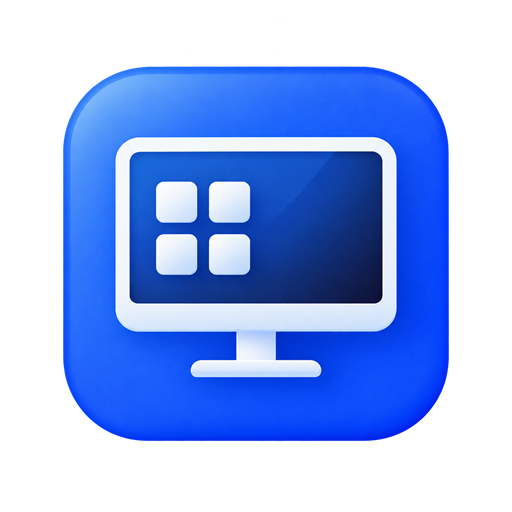

<p align="center">
  
</p>

<h1 align="center">DesktopLayoutGuardian</h1>

<p align="center">为不同显示环境自动保存并恢复 Windows 11 桌面图标布局。</p>

## 适合什么场景

如果你经常在笔记本内屏、外接显示器和远程虚拟屏幕之间切换，分辨率与缩放变化可能会打乱桌面图标。DesktopLayoutGuardian 会识别当前显示环境，并自动应用此前为它保存的布局。

程序目前专注于“同一时间只使用一块屏幕”的场景，已在以下环境完成实际验证：

- 笔记本内置屏幕；
- ROG XG27AQDMES 外接显示器；
- UU 远程的超级屏幕。

## 主要功能

- 按显示器、分辨率、缩放和方向分别保存桌面布局；
- 切换到保存过的显示环境后自动恢复；
- 新显示环境不会擅自移动图标；
- 新增图标保持当前位置，重新保存后才会写入方案；
- 保存布局时生成纯桌面预览，不会截取已打开的窗口；
- 支持方案重命名、安全删除和历史版本恢复；
- 每次恢复前创建安全快照，可以撤销最近一次恢复；
- 支持快速、标准、稳健三档检测策略；
- 常驻系统托盘，可选择登录 Windows 后自动运行；
- 数据全部保存在本机，不需要账号，也不会上传桌面内容。

## 下载与运行

前往 [Releases](https://github.com/Jellyfish-Puff/DesktopLayoutGuardian/releases) 下载最新版 `DesktopLayoutGuardian-v1.0.0-win-x64.exe`。

1. 将程序放在一个固定位置，例如 `D:\Apps\DesktopLayoutGuardian`。
2. 双击运行；程序无需安装。
3. 如果 Windows 提示缺少运行环境，请安装 [.NET 10 Desktop Runtime（Windows x64）](https://dotnet.microsoft.com/download/dotnet/10.0)。
4. 整理好当前屏幕下的桌面图标，点击“保存当前布局”。
5. 在其他显示环境中分别整理并保存一次。
6. 之后保持程序在系统托盘运行，切换屏幕时会自动恢复匹配的布局。

> 使用前请在桌面右键菜单的“查看”中关闭“自动排列图标”。“将图标与网格对齐”可以保持开启。

## 使用建议

- 实体显示器通常使用“标准”检测策略即可。
- UU 超级屏或切换较慢的环境建议在设置中选择“稳健”。
- 同一显示器更换刷新率不会被视为新方案。
- 更改分辨率、缩放比例或屏幕方向后，会被视为不同布局，需要单独保存。
- 点击窗口关闭按钮只会隐藏到系统托盘；如需完全结束，请在托盘菜单中选择“退出”。

## 数据与隐私

方案、预览、历史和设置都位于：

```text
%LOCALAPPDATA%\DesktopLayoutGuardian
```

程序不会使用 OneDrive，也不会读取或上传桌面文件内容。它只通过 Windows 桌面接口记录图标身份与坐标，并在本地生成布局预览。

安全删除的方案会移入 `deleted` 目录；需要时可以从本地数据中找回。设置页面也提供数据目录、日志清理和旧历史清理入口。

## 当前限制

- 仅支持 Windows 11 x64；
- 仅支持恰好一个活动显示器；
- 不会自动处理开启了“自动排列图标”的桌面；
- 更换电脑或重装系统后，建议重新保存各显示环境的方案。

## 遇到问题

请先在设置页面复制完整诊断信息，并在 [GitHub Issues](https://github.com/Jellyfish-Puff/DesktopLayoutGuardian/issues) 中说明发生问题时使用的显示器、分辨率和缩放比例。诊断日志默认位于：

```text
%LOCALAPPDATA%\DesktopLayoutGuardian\diagnostics
```

## 开发

项目的架构、安全约束、构建测试和后续开发说明统一记录在 [DEVELOPMENT.md](DEVELOPMENT.md)。版本变化参见 [CHANGELOG.md](CHANGELOG.md)。
